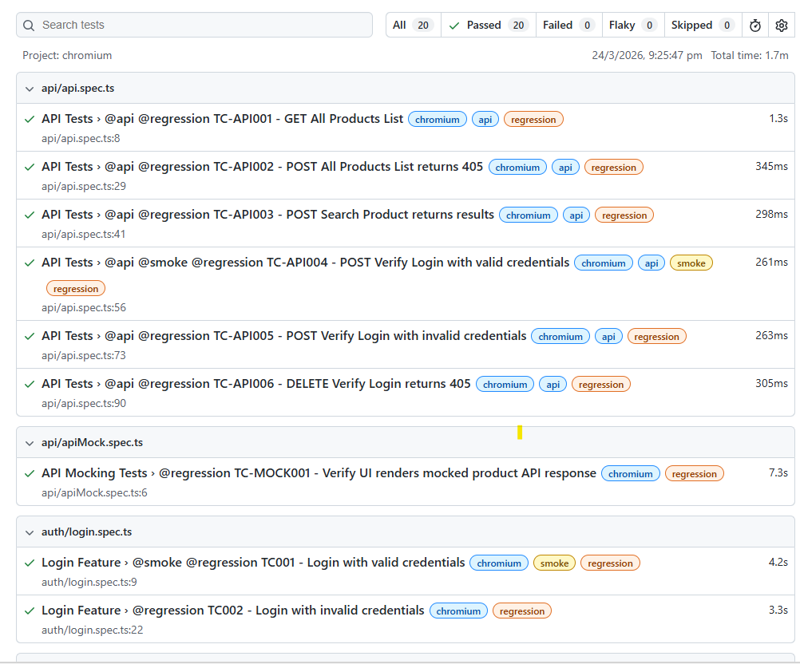

# 🎭 RDTSAutomation2026 — Production-Grade Test Automation Framework


---

## 📌 Why This Project Exists

After 8+ years in test automation and a career break, I built this framework from scratch to demonstrate that production-grade automation skills don't go stale — they evolve.

This is not a tutorial project. It is a **real-world, multi-layer automation framework** covering UI, API, Database, and AI-powered reporting — the kind of framework you would architect and deliver in a senior role.

Target application: [AutomationExercise.com](https://automationexercise.com) — a purpose-built e-commerce practice site that mirrors real-world complexity.

---

## 🏗️ Framework Architecture

```
┌─────────────────────────────────────────────────────┐
│               Test Layer (*.spec.ts)                │
│    UI Tests │ API Tests │ DB Tests │ Mock Tests      │
└────────────────────────┬────────────────────────────┘
                         ↓
┌─────────────────────────────────────────────────────┐
│           Page Object Model (pages/)                │
│   BasePage │ LoginPage │ SignupPage │ ProductsPage   │
└────────────────────────┬────────────────────────────┘
                         ↓
┌─────────────────────────────────────────────────────┐
│        Fixtures │ Interfaces │ Utils │ DB Layer      │
│   userFactory │ IUser │ dbHelper │ testdata.db       │
└────────────────────────┬────────────────────────────┘
                         ↓
┌─────────────────────────────────────────────────────┐
│              Playwright Engine                      │
└────────────────────────┬────────────────────────────┘
                         ↓
┌─────────────────────────────────────────────────────┐
│         AI Reporting Layer (ai/)                    │
│  aiReporter │ reportSummariser │ failureAnalyser     │
└────────────────────────┬────────────────────────────┘
                         ↓
┌─────────────────────────────────────────────────────┐
│           CI/CD Pipeline (GitHub Actions)           │
└─────────────────────────────────────────────────────┘
```

---

## 🚀 Tech Stack

| Tool | Purpose |
|---|---|
| [Playwright](https://playwright.dev/) | UI & API browser automation |
| [TypeScript](https://www.typescriptlang.org/) | Strongly-typed test design |
| [Node.js](https://nodejs.org/) | Runtime environment |
| [SQLite](https://www.sqlite.org/) | Embedded database for DB testing |
| [Anthropic Claude](https://www.anthropic.com/) | AI-powered test reporting, failure analysis & data generation |
| [GitHub Actions](https://github.com/features/actions) | CI/CD pipeline |
| [dotenv](https://www.npmjs.com/package/dotenv) | Environment variable management |
| [Postman](https://www.postman.com/) | API collection management & manual testing |
| [Playwright HTML Reporter](https://playwright.dev/docs/test-reporters) | Interactive test reporting |

---

## 🎯 Key Features

- ✅ **Page Object Model (POM)** with a shared `BasePage` for reusable actions
- ✅ **UI Testing** — Auth, Products, Cart, Checkout flows
- ✅ **API Testing** — REST API validation with positive and negative scenarios
- ✅ **API Mock Testing** — Mocked API responses using Playwright's route interception
- ✅ **Database Testing** — SQLite-based DB validation via `dbHelper.ts`
- ✅ **AI Executive Summary** — Post-run AI report generated automatically via `onEnd()` hook
- ✅ **AI Failure Analysis** — Intelligent root cause summaries for test failures
- ✅ **Test Case Generation** — AI-assisted test case suggestions
- ✅ **Test Data Generation** — Dynamic data generation via AI
- ✅ **Data-Driven Testing** — JSON fixtures + dynamic `userFactory`
- ✅ **TypeScript Interfaces** — Type-safe test data contracts
- ✅ **Cross-Browser Testing** — Chromium, Firefox, WebKit
- ✅ **CI/CD Pipeline** — Automated runs on every push/PR via GitHub Actions
- ✅ **Retry, Trace, Screenshot & Video** on failure
- ✅ **Postman Collections** — Parallel API collection for manual/exploratory testing
- ✅ **Environment-Based Configuration** — `.env` driven credentials & config

---

## 📁 Project Structure

```
RDTSAutomation2026/
├── .github/
│   └── workflows/
│       └── playwright.yml          # CI/CD pipeline
│
├── ai/                             # AI-powered testing & reporting layer
│   ├── aiHelper.ts                 # Shared AI utility / OpenAI wrapper
│   ├── aiReporter.ts               # Custom Playwright reporter with AI summary
│   ├── failureAnalyser.ts          # AI root cause analysis for failures
│   ├── reportSummariser.ts         # Executive report summarisation
│   ├── testAI.ts                   # AI module validation tests
│   ├── testCaseGenerator.ts        # AI-assisted test case generation
│   ├── testDataGenerator.ts        # AI-assisted test data generation
│   └── index.ts                    # Barrel exports
│
├── db/
│   ├── dbHelper.ts                 # SQLite DB connection & query helpers
│   └── testdata.db                 # SQLite test database
│
├── docs/
│   ├── framework-architecture.md   # Architecture documentation
│   ├── playwright-report.png       # Sample report screenshot
│   └── test-strategy.md            # Test strategy document
│
├── fixtures/
│   ├── products.json               # Product search terms (data-driven)
│   └── userFactory.ts              # Dynamic user data generator
│
├── interfaces/
│   └── IUser.ts                    # TypeScript interface for user data
│
├── pages/                          # Page Object Models
│   ├── BasePage.ts                 # Shared base class for all pages
│   ├── loginPage.ts
│   ├── signupPage.ts
│   ├── accountPage.ts
│   └── productsPage.ts
│
├── postman/                        # Postman collection files
│
├── tests/
│   ├── api/
│   │   ├── api.spec.ts             # REST API test cases
│   │   └── apiMock.spec.ts         # Mocked API scenarios
│   ├── auth/
│   │   ├── login.spec.ts
│   │   ├── logout.spec.ts
│   │   └── signup.spec.ts
│   ├── cart/                       # 🔲 In Progress
│   ├── checkout/                   # 🔲 In Progress
│   ├── db/
│   │   └── db.spec.ts              # Database test cases
│   └── products/
│       └── products.spec.ts
│
├── utils/                          # Shared helper utilities
├── test-results/
│   └── ai-summary.json             # AI-generated summary (auto-created post-run)
├── .env.example                    # Environment variable template
├── playwright.config.ts
├── tsconfig.json
└── README.md
```

---

## 🤖 AI Integration Layer

This framework includes a custom AI-powered reporting and analysis layer — a key differentiator from standard automation frameworks.

### ✅ All AI Modules Complete

The full AI layer is built and working, powered by **Anthropic Claude** (`claude-sonnet-4-5`).

| Module | Purpose | Status |
|---|---|---|
| `aiHelper.ts` | Claude API wrapper with configurable token limits | ✅ |
| `aiReporter.ts` | Custom Playwright reporter — hooks into `onEnd()` | ✅ |
| `failureAnalyser.ts` | AI root cause analysis per failed test | ✅ |
| `reportSummariser.ts` | Executive summary saved to `ai-summary.json` | ✅ |
| `testCaseGenerator.ts` | Generates structured JSON + readable TXT test cases | ✅ |
| `testDataGenerator.ts` | Generates users, products, addresses & bulk data | ✅ |
| `index.ts` | Barrel exports for all functions and interfaces | ✅ |

**AI Executive Summary** — printed to console and saved after every test run:

```
🤖 AI EXECUTIVE TEST SUMMARY
─────────────────────────────────────────
Overall Status : PASSED
Passed         : 20/20
Risk Level     : Low

Summary:
All test suites completed with a 100% pass rate. No critical failures detected.
System is stable and ready for deployment.

Key Findings:
  → All authentication flows passed successfully
  → API endpoints returning expected responses
  → No performance degradation detected

Recommendations:
  → Continue monitoring checkout flow as coverage expands
─────────────────────────────────────────
```

**AI Failure Analysis** — triggered automatically per failed test:

```
🤖 AI Failure Analysis
──────────────────────────────────────────────────
Test: TC001 - Login with valid credentials
📍 Root Cause    : Login redirect did not complete within timeout
🔧 Suggested Fix : Increase waitForURL timeout or add explicit wait for nav
⚠️  Priority      : High
──────────────────────────────────────────────────
```

**AI Test Case Generator** — saves structured JSON + readable TXT to `test-results/`:

```
ai-testcases-login-page.json    ← structured, programmatically usable
ai-testcases-login-page.txt     ← human readable
```

**AI Test Data Generator** — generates contextual, unique test data:

```typescript
const user    = await generateTestUser('New registration for e-commerce');
const product = await generateTestProduct('Women clothing search');
const address = await generateTestAddress('US checkout flow');
const users   = await generateBulkUsers(5, 'Load testing scenario');
```

---

## 🧪 Test Coverage

### ✅ UI Tests

| # | Test Case | Module | Status |
|---|---|---|---|
| TC001 | Login with valid credentials | Auth | ✅ |
| TC002 | Login with invalid credentials | Auth | ✅ |
| TC003 | Register new user, delete & verify deletion | Auth | ✅ |
| TC004 | Logout successfully | Auth | ✅ |
| TC005 | Search for a product (data-driven) | Products | ✅ |
| TC006 | View product details | Products | 🔲 In Progress |
| TC007 | Add product to cart | Cart | 🔲 In Progress |
| TC008 | Remove product from cart | Cart | 🔲 In Progress |
| TC009 | Place order (login before checkout) | Checkout | 🔲 In Progress |
| TC010 | Contact Us form | UI | 🔲 In Progress |

### 🔌 API Tests

| # | Test Case | Module | Status |
|---|---|---|---|
| TC-API001 | GET All Products List | API | ✅ |
| TC-API002 | POST All Products List (405 validation) | API | ✅ |
| TC-API003 | POST Search Product | API | ✅ |
| TC-API004 | POST Verify Login — valid credentials | API | ✅ |
| TC-API005 | POST Verify Login — invalid credentials | API | ✅ |
| TC-API006 | DELETE Verify Login (405 validation) | API | ✅ |
| TC-API007 | Mocked API response — product list | API Mock | ✅ |

### 🗄️ Database Tests

| # | Test Case | Module | Status |
|---|---|---|---|
| TC-DB001 | Database contains seeded products | DB | ✅ |
| TC-DB002 | Verify specific product data integrity | DB | ✅ |
| TC-DB003 | Verify all products have valid categories | DB | ✅ |
| TC-DB004 | Query products by category | DB | ✅ |
| TC-DB005 | Query product by ID | DB | ✅ |
| TC-DB006 | Non-existent product returns undefined | DB | ✅ |
| TC-DB007 | Insert user and verify record in DB | DB | ✅ |
| TC-DB008 | Delete user and verify removed from DB | DB | ✅ |
| TC-DB009 | Non-existent user returns false | DB | ✅ |
| TC-DB010 | Duplicate email handled gracefully | DB | ✅ |

---

## ⚙️ Setup & Installation

### Prerequisites
- Node.js `v18+`
- npm `v9+`
- Git
- Anthropic Claude API Key (for AI features)

### Steps

```bash
# 1. Clone the repository
git clone https://github.com/lakshmisoujanyasouji-oss/playwright-automation-exercise.git
cd RDTSAutomation2026

# 2. Install dependencies
npm install

# 3. Install Playwright browsers
npx playwright install

# 4. Set up environment variables
cp .env.example .env
# Edit .env with your credentials
```

### `.env.example`
```
TEST_EMAIL=your_test_email@example.com
TEST_PASSWORD=your_test_password
CLAUDE_API_KEY=your_claude_api_key
```

---

## ▶️ Running Tests

```bash
# Run all tests
npx playwright test

# Run by module
npx playwright test tests/auth/
npx playwright test tests/api/
npx playwright test tests/db/
npx playwright test tests/products/

# Run specific file
npx playwright test tests/auth/login.spec.ts

# Run on specific browser
npx playwright test --project=chromium
npx playwright test --project=firefox
npx playwright test --project=webkit

# Run by test tags
npx playwright test --grep @smoke
npx playwright test --grep @regression
npx playwright test --grep @api
npx playwright test --grep @db

# Run in debug mode
npx playwright test --debug

# View HTML report
npx playwright show-report
```

---

## 🏗️ Design Patterns

### BasePage Pattern

All page objects extend `BasePage`, which encapsulates shared actions like navigation, waits, and common assertions — reducing duplication across the page layer.

```typescript
// pages/BasePage.ts
export class BasePage {
  constructor(protected page: Page) {}

  async navigateTo(path: string): Promise<void> {
    await this.page.goto(path);
  }

  async waitForPageLoad(): Promise<void> {
    await this.page.waitForLoadState('networkidle');
  }
}
```

### Page Object Model

All page interactions are encapsulated in dedicated classes under `/pages`.

```typescript
// pages/loginPage.ts
export class LoginPage extends BasePage {
  readonly emailInput = this.page.locator('[data-qa="login-email"]');
  readonly passwordInput = this.page.locator('[data-qa="login-password"]');
  readonly loginButton = this.page.locator('[data-qa="login-button"]');

  async login(email: string, password: string): Promise<void> {
    await this.emailInput.fill(email);
    await this.passwordInput.fill(password);
    await this.loginButton.click();
  }
}
```

### TypeScript Interface

```typescript
// interfaces/IUser.ts
export interface IUser {
  name: string;
  email?: string;
  password: string;
  firstName: string;
  lastName: string;
  address: string;
  country: string;
  state: string;
  city: string;
  zipcode: string;
  mobile: string;
}
```

### Data-Driven Testing

```typescript
// fixtures/products.json → { "searchTerms": ["Top", "Dress", "Jeans"] }

searchData.searchTerms.forEach(term => {
  test(`TC005 - Search for product: ${term}`, async ({ page }) => {
    await productsPage.searchProduct(term);
    await productsPage.expectResultsVisible(term);
  });
});
```

---

## 🔄 CI/CD — GitHub Actions

Tests run automatically on every `push` and `pull_request` to `main`, across all three browsers in headless mode.

```yaml
name: Playwright Tests
on:
  push:
    branches: [main]
  pull_request:
    branches: [main]
jobs:
  test:
    runs-on: ubuntu-latest
    steps:
      - uses: actions/checkout@v3
      - uses: actions/setup-node@v3
        with:
          node-version: 18
      - run: npm ci
      - run: npx playwright install --with-deps
      - run: npx playwright test
      - uses: actions/upload-artifact@v3
        if: always()
        with:
          name: playwright-report
          path: playwright-report/
```

---

## 📊 Sample Test Report



The HTML report includes execution summary, screenshots on failure, trace viewer, and video recordings.

---

## 🗺️ Roadmap

- [x] AI Executive Summary & Failure Analysis
- [x] AI Test Case Generator (structured JSON output)
- [x] AI Test Data Generator (user, product, address, bulk)
- [x] Database testing layer (SQLite, 10 test cases)
- [ ] Complete Cart & Checkout UI test coverage
- [ ] Integrate Allure reporting
- [ ] Add visual regression testing

---

## 🤝 Contributing

This is a personal portfolio project, but feedback and suggestions are welcome. Feel free to open an issue or submit a pull request.

---

## 📄 License

This project is licensed under the [MIT License](LICENSE).

---

## 👤 Author

**Lakshmi Soujanya**
Senior Test Automation Engineer | Playwright • TypeScript • AI-Enhanced Testing

- 🔗 LinkedIn: [linkedin.com/in/lakshmisoujanya](https://www.linkedin.com/in/lakshmisoujanya/)
- 🐙 GitHub: [github.com/lakshmisoujanyasouji-oss](https://github.com/lakshmisoujanyasouji-oss)
- 📍 Singapore

---

> ⭐ If you find this project useful, give it a star on GitHub!