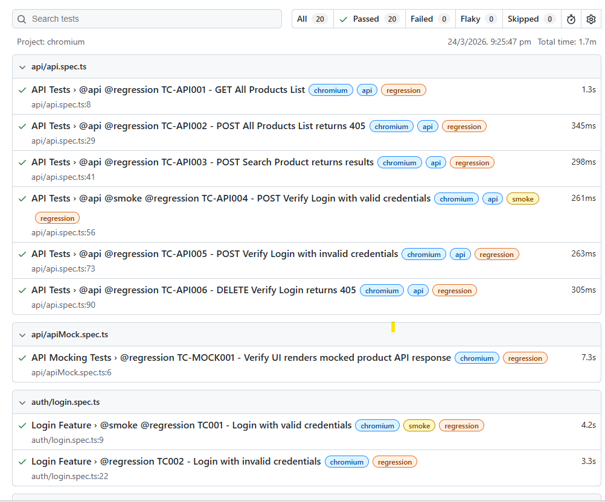

# 🎭 RDTSAutomation2026 — Production-Grade Test Automation Framework


[](https://github.com/lakshmisoujanyasouji-oss/RDTSAutomation2026/actions/workflows/playwright.yml)


---

## 📌 Why This Project Exists

After 8+ years in test automation and a career break, I built this framework from scratch to demonstrate that production-grade automation skills don't go stale — they evolve.

This is not a tutorial project. It is a **real-world, multi-layer automation framework** covering UI, API, Database, and AI-powered reporting — the kind of framework you would architect and deliver in a senior role.

Target application: [AutomationExercise.com](https://automationexercise.com) — a purpose-built e-commerce practice site that mirrors real-world complexity.

---

## 🏗️ Framework Architecture

```
┌─────────────────────────────────────────────────────────────┐
│                     Global Setup                            │
│     Env validation │ DB initialization │ Data seeding       │
└────────────────────────────┬────────────────────────────────┘
                             ↓
┌─────────────────────────────────────────────────────────────┐
│               Test Layer (*.spec.ts)                        │
│    UI Tests │ API Tests │ DB Tests │ Mock Tests              │
└────────────────────────────┬────────────────────────────────┘
                             ↓
┌─────────────────────────────────────────────────────────────┐
│             Page Object Model (pages/)                      │
│ BasePage │ LoginPage │ SignupPage │ CartPage │ CheckoutPage  │
└────────────────────────────┬────────────────────────────────┘
                             ↓
┌─────────────────────────────────────────────────────────────┐
│      Fixtures │ Interfaces │ Utils │ DB Layer                │
│  fixtures/index.ts │ IUser │ ApiHelper │ dbHelper            │
└────────────────────────────┬────────────────────────────────┘
                             ↓
┌─────────────────────────────────────────────────────────────┐
│                  Playwright Engine                          │
│   playwright.config.ts │ Multi-reporter │ Global timeouts   │
└────────────────────────────┬────────────────────────────────┘
                             ↓
┌─────────────────────────────────────────────────────────────┐
│              AI Reporting Layer (ai/)                       │
│    aiReporter │ failureAnalyser │ reportSummariser           │
└────────────────────────────┬────────────────────────────────┘
                             ↓
┌─────────────────────────────────────────────────────────────┐
│                    Global Teardown                          │
│     Test user cleanup │ DB connection close │ Run logging   │
└────────────────────────────┬────────────────────────────────┘
                             ↓
┌─────────────────────────────────────────────────────────────┐
│              CI/CD Pipeline (GitHub Actions)                │
│      HTML │ JSON │ JUnit reporters │ Artifact upload        │
└─────────────────────────────────────────────────────────────┘
```

---

## 🚀 Tech Stack

| Tool | Purpose |
|---|---|
| [Playwright](https://playwright.dev/) | UI & API browser automation |
| [TypeScript](https://www.typescriptlang.org/) | Strongly-typed test design |
| [Node.js](https://nodejs.org/) | Runtime environment |
| [SQLite + better-sqlite3](https://www.sqlite.org/) | Embedded database for DB testing |
| [Anthropic Claude](https://www.anthropic.com/) | AI-powered reporting, failure analysis & data generation |
| [GitHub Actions](https://github.com/features/actions) | CI/CD pipeline |
| [dotenv](https://www.npmjs.com/package/dotenv) | Environment variable management |
| [ts-node](https://typestrong.org/ts-node/) | TypeScript execution for AI demo runner |
| [Postman](https://www.postman.com/) | API collection management & manual testing |

---

## 🎯 Key Features

- ✅ **Page Object Model (POM)** with shared `BasePage` — OOP inheritance pattern
- ✅ **Playwright Fixtures** — Dependency injection for all page objects
- ✅ **Global Setup & Teardown** — Env validation, DB seeding, auto cleanup
- ✅ **API Helper Class** — Typed HTTP wrapper with domain-specific methods
- ✅ **UI Testing** — Auth, Products, Cart, Checkout flows (12 tests)
- ✅ **API Testing** — REST API validation with positive and negative scenarios
- ✅ **API Mock Testing** — Route interception using Playwright's built-in network mocking
- ✅ **Database Testing** — SQLite CRUD validation (10 tests)
- ✅ **AI Executive Summary** — Post-run AI report via `onEnd()` hook
- ✅ **AI Failure Analysis** — Root cause analysis per failed test
- ✅ **AI Test Case Generator** — Structured JSON + TXT from page descriptions
- ✅ **AI Test Data Generator** — Users, products, addresses & bulk data
- ✅ **Data-Driven Testing** — JSON fixtures + dynamic `userFactory`
- ✅ **TypeScript Interfaces** — Type-safe test data contracts
- ✅ **Multi-Reporter Setup** — HTML, JSON, JUnit, AI reporter
- ✅ **CI/CD Pipeline** — GitHub Actions on every push/PR
- ✅ **Retry, Trace, Screenshot & Video** on failure
- ✅ **Environment-Based Configuration** — `.env` driven credentials & config

---

## 📁 Project Structure

```
RDTSAutomation2026/
├── .github/
│   └── workflows/
│       └── playwright.yml           # CI/CD pipeline
│
├── ai/                              # AI-powered testing & reporting layer
│   ├── aiHelper.ts                  # Claude API wrapper
│   ├── aiReporter.ts                # Custom Playwright reporter
│   ├── failureAnalyser.ts           # AI root cause analysis per failure
│   ├── reportSummariser.ts          # AI executive summary generation
│   ├── testAI.ts                    # AI demo runner
│   ├── testCaseGenerator.ts         # AI test case generation
│   ├── testDataGenerator.ts         # AI test data generation
│   └── index.ts                     # Barrel exports
│
├── db/
│   ├── dbHelper.ts                  # SQLite connection, interfaces & CRUD helpers
│   └── testdata.db                  # SQLite test database
│
├── docs/
│   ├── ci-pipeline-green.png        # CI evidence screenshot
│   ├── framework-architecture.md    # Architecture documentation
│   ├── playwright-report.png        # Sample report screenshot
│   └── test-strategy.md             # Test strategy document
│
├── fixtures/
│   ├── index.ts                     # Custom test with injected page fixtures
│   ├── products.json                # Product search terms (data-driven)
│   └── userFactory.ts               # Dynamic user data generator
│
├── interfaces/
│   └── IUser.ts                     # TypeScript interface for user data
│
├── pages/                           # Page Object Models
│   ├── BasePage.ts                  # Shared base class — OOP inheritance
│   ├── loginPage.ts
│   ├── signupPage.ts
│   ├── accountPage.ts
│   ├── productsPage.ts
│   ├── cartPage.ts
│   └── checkoutPage.ts
│
├── postman/                         # Postman collection files
│
├── tests/
│   ├── api/
│   │   ├── api.spec.ts              # REST API test cases
│   │   └── apiMock.spec.ts          # Mocked API scenarios
│   ├── auth/
│   │   ├── login.spec.ts
│   │   ├── logout.spec.ts
│   │   └── signup.spec.ts
│   ├── cart/
│   │   └── cart.spec.ts             # Cart test cases
│   ├── checkout/
│   │   └── checkout.spec.ts         # Checkout & order test cases
│   ├── db/
│   │   └── db.spec.ts               # Database test cases
│   └── products/
│       └── products.spec.ts
│
├── utils/                           # Shared helper utilities
│   ├── apiHelper.ts                 # Typed HTTP wrapper class
│   ├── dateHelper.ts                # Date formatting helpers
│   ├── urlHelper.ts                 # URL assertion helpers
│   ├── waitHelper.ts                # Custom wait utilities
│   └── index.ts                     # Barrel exports
│
├── test-results/                    # Auto-generated after every run
│   ├── ai-summary.json              # AI Executive Summary
│   └── results.json                 # Machine-readable test results
│
├── global-setup.ts                  # Runs once before all tests
├── global-teardown.ts               # Runs once after all tests
├── .env.example                     # Environment variable template
├── playwright.config.ts             # Playwright configuration
├── tsconfig.json
└── README.md
```

---

## 🤖 AI Integration Layer

This framework includes a custom AI-powered reporting and analysis layer — powered by **Anthropic Claude** (`claude-sonnet-4-5`).

| Module | Purpose | Status |
|---|---|---|
| `aiHelper.ts` | Claude API wrapper with configurable token limits | ✅ |
| `aiReporter.ts` | Custom reporter — hooks into `onEnd()` and `onTestEnd()` | ✅ |
| `failureAnalyser.ts` | AI root cause analysis per failed test | ✅ |
| `reportSummariser.ts` | Executive summary saved to `ai-summary.json` | ✅ |
| `testCaseGenerator.ts` | Generates structured JSON + readable TXT test cases | ✅ |
| `testDataGenerator.ts` | Generates users, products, addresses & bulk data | ✅ |
| `index.ts` | Barrel exports for all functions and interfaces | ✅ |

**AI Executive Summary** — generated after every test run:

```
🤖 AI EXECUTIVE TEST SUMMARY
============================================================
Overall Status : PASSED
Passed         : 32/32
Risk Level     : Low

Summary:
All 32 test cases executed successfully with a 100% pass rate.
System is stable and ready for deployment.

Key Findings:
  → Perfect test execution with zero failures across all 32 scenarios
  → No critical, major, or minor defects identified
  → System functionality meets all acceptance criteria

Recommendations:
  → Proceed with deployment to production environment
============================================================
```

**AI Failure Analysis** — triggered automatically per failed test:

```
🤖 AI Failure Analysis
──────────────────────────────────────────────────
Test: TC001 - Login with valid credentials
📍 Root Cause    : Login redirect did not complete within timeout
🔧 Suggested Fix : Increase waitForURL timeout or add explicit wait
⚠️  Priority      : High
──────────────────────────────────────────────────
```

**AI Test Case Generator** — saves to `test-results/`:

```
ai-testcases-login-page.json    ← structured, programmatically usable
ai-testcases-login-page.txt     ← human readable
```

**AI Test Data Generator:**

```typescript
const user    = await generateTestUser('New registration for e-commerce');
const product = await generateTestProduct('Women clothing search');
const address = await generateTestAddress('US checkout flow');
const users   = await generateBulkUsers(5, 'Load testing scenario');
```

---

## 🧪 Test Coverage — 32 Tests | 100% Pass Rate

### ✅ UI Tests (12)

| # | Test Case | Module | Status |
|---|---|---|---|
| TC001 | Login with valid credentials | Auth | ✅ |
| TC002 | Login with invalid credentials | Auth | ✅ |
| TC003 | Register new user, delete & verify deletion | Auth | ✅ |
| TC004 | Logout successfully | Auth | ✅ |
| TC005 | Search for a product (data-driven x3) | Products | ✅ |
| TC007 | Add product to cart and verify | Cart | ✅ |
| TC008 | Verify cart displays added product details | Cart | ✅ |
| TC009 | Remove product from cart and verify empty | Cart | ✅ |
| TC010 | Verify checkout button visible with items | Cart | ✅ |
| TC011 | Verify checkout page displays address & order | Checkout | ✅ |
| TC012 | Place order successfully with valid payment | Checkout | ✅ |
| TC013 | Verify order comment field accepts input | Checkout | ✅ |
| TC014 | Verify place order button visible | Checkout | ✅ |

### 🔌 API Tests (7)

| # | Test Case | Module | Status |
|---|---|---|---|
| TC-API001 | GET All Products List | API | ✅ |
| TC-API002 | POST All Products List (405 validation) | API | ✅ |
| TC-API003 | POST Search Product | API | ✅ |
| TC-API004 | POST Verify Login — valid credentials | API | ✅ |
| TC-API005 | POST Verify Login — invalid credentials | API | ✅ |
| TC-API006 | DELETE Verify Login (405 validation) | API | ✅ |
| TC-MOCK001 | Mocked API response via route interception | API Mock | ✅ |

### 🗄️ Database Tests (10)

| # | Test Case | Module | Status |
|---|---|---|---|
| TC-DB001 | Database contains seeded products | DB | ✅ |
| TC-DB002 | Verify specific product data integrity | DB | ✅ |
| TC-DB003 | Verify all products have valid categories | DB | ✅ |
| TC-DB004 | Query products by category | DB | ✅ |
| TC-DB005 | Query product by ID | DB | ✅ |
| TC-DB006 | Non-existent product returns undefined | DB | ✅ |
| TC-DB007 | Insert user and verify record in DB | DB | ✅ |
| TC-DB008 | Delete user and verify removed from DB | DB | ✅ |
| TC-DB009 | Non-existent user returns false | DB | ✅ |
| TC-DB010 | Duplicate email handled gracefully | DB | ✅ |

---

## 🏗️ Design Patterns & Engineering Decisions

### 1. Playwright Fixtures — Dependency Injection

All page objects are defined once and auto-injected into any test:

```typescript
// fixtures/index.ts — define once
export const test = base.extend<PageFixtures>({
    loginPage: async ({ page }, use) => {
        await use(new LoginPage(page));
    },
    // authenticated fixture — handles login automatically
    authenticatedPage: async ({ page }, use) => {
        const loginPage = new LoginPage(page);
        await loginPage.goto();
        await loginPage.login(
            process.env.TEST_EMAIL!,
            process.env.TEST_PASSWORD!
        );
        await use(loginPage);
    }
});

// In tests — clean, no boilerplate
test('add to cart', async ({ cartPage, productsPage }) => {
    await productsPage.addFirstProductToCart();
    await cartPage.expectCartHasItems();
});
```

### 2. BasePage Pattern — OOP Inheritance

All page classes extend `BasePage` — demonstrating all 4 OOP principles:

| Principle | Implementation |
|---|---|
| **Inheritance** | `LoginPage extends BasePage` |
| **Encapsulation** | Locators are `readonly` — private to each page |
| **Abstraction** | Tests call `login()` without knowing HOW it works |
| **Polymorphism** | Each page overrides `goto()` with its own path |

```typescript
// pages/BasePage.ts — parent class
export class BasePage {
    constructor(protected page: Page) {}
    async goto(path: string): Promise<void> { ... }
    async waitForPageLoad(): Promise<void> { ... }
    async takeScreenshot(name: string): Promise<void> { ... }
}

// pages/loginPage.ts — child class
export class LoginPage extends BasePage {
    constructor(page: Page) { super(page); }
    async goto(): Promise<void> { await super.goto('/login'); }
    async login(email: string, password: string): Promise<void> { ... }
}
```

### 3. API Helper Class — Typed HTTP Wrapper

```typescript
// utils/apiHelper.ts
export class ApiHelper {
    async getAllProducts(): Promise<ApiResponse<ProductsResponse>> { ... }
    async verifyLogin(email: string, password: string): Promise<ApiResponse<LoginResponse>> { ... }
    async searchProduct(term: string): Promise<ApiResponse<ProductsResponse>> { ... }
}

// In tests — clean, typed, no noise
test('TC-API001', async ({ request }) => {
    const api = new ApiHelper(request);
    const response = await api.getAllProducts();
    expect(response.body.products.length).toBeGreaterThan(0);
});
```

### 4. Global Setup & Teardown

```
// global-setup.ts — runs ONCE before all 32 tests
✅ Verify TEST_EMAIL, TEST_PASSWORD, CLAUDE_API_KEY exist
✅ Initialize SQLite database and seed test data
✅ Log test run start time & environment info

// global-teardown.ts — runs ONCE after all 32 tests
✅ Clean up test users from database automatically
✅ Close database connection properly
✅ Log test run completion time
```

### 5. Data-Driven Testing

```typescript
// fixtures/products.json → { "searchTerms": ["Top", "Dress", "Jeans"] }

searchData.searchTerms.forEach(term => {
    test(`TC005 - Search for product: ${term}`, async ({ productsPage }) => {
        await productsPage.searchProduct(term);
        await productsPage.expectResultsVisible(term);
    });
});
```

---

## ⚙️ Setup & Installation

### Prerequisites
- Node.js `v18+`
- npm `v9+`
- Git
- Anthropic Claude API Key (for AI features)

### Steps

```bash
# 1. Clone the repository
git clone https://github.com/lakshmisoujanyasouji-oss/RDTSAutomation2026.git
cd RDTSAutomation2026

# 2. Install dependencies
npm install

# 3. Install Playwright browsers
npx playwright install

# 4. Set up environment variables
cp .env.example .env
# Edit .env with your credentials
```

### `.env.example`
```
TEST_EMAIL=your_test_email@example.com
TEST_PASSWORD=your_test_password
CLAUDE_API_KEY=your_claude_api_key
```

---

## ▶️ Running Tests

```bash
# Run all tests
npm test

# Run by module
npm run test:ui
npm run test:api
npm run test:mock
npm run test:db

# Run by tags
npm run test:smoke
npm run test:regression

# Run AI demo
npm run test:ai

# Run in debug mode
npm run test:debug

# View HTML report
npm run report
```

---

## 📊 Reporting

This framework uses a **multi-reporter setup**:

| Reporter | Output | Purpose |
|---|---|---|
| `html` | `playwright-report/` | Interactive visual report with trace viewer |
| `json` | `test-results/results.json` | Machine-readable results |
| `junit` | `test-results/junit-report.xml` | CI tool integration |
| `github` | GitHub PR annotations | CI failure visibility |
| `ai` | `test-results/ai-summary.json` | AI Executive Summary |

```bash
# View interactive HTML report
npm run report

# View JSON results
npm run report:json
```

---

## 🔄 CI/CD — GitHub Actions

Tests run automatically on every `push` and `pull_request` to `main`.

```yaml
name: Playwright Tests
on:
  push:
    branches: [main]
  pull_request:
    branches: [main]
jobs:
  test:
    runs-on: ubuntu-latest
    steps:
      - uses: actions/checkout@v4
      - uses: actions/setup-node@v4
        with:
          node-version: lts/*
      - run: npm ci
      - run: npx playwright install --with-deps
      - run: npx playwright test
        env:
          CLAUDE_API_KEY: ${{ secrets.CLAUDE_API_KEY }}
          TEST_EMAIL: ${{ secrets.TEST_EMAIL }}
          TEST_PASSWORD: ${{ secrets.TEST_PASSWORD }}
      - uses: actions/upload-artifact@v4
        if: always()
        with:
          name: playwright-report
          path: playwright-report/
          retention-days: 30
```

---

## 📊 Sample Test Report



The HTML report includes execution summary, screenshots on failure, trace viewer, and video recordings.

---

## 🗺️ Roadmap

- [x] AI Executive Summary & Failure Analysis
- [x] AI Test Case Generator (structured JSON output)
- [x] AI Test Data Generator (user, product, address, bulk)
- [x] Database testing layer (SQLite, 10 test cases)
- [x] Cart & Checkout UI test coverage
- [x] Playwright Fixtures — dependency injection
- [x] API Helper Class — typed HTTP wrapper
- [x] Global Setup & Teardown
- [x] Multi-reporter setup (HTML, JSON, JUnit, AI)
- [x] utils/index.ts & ai/index.ts barrel exports
- [ ] Visual regression testing

---

## 🤝 Contributing

This is a personal portfolio project, but feedback and suggestions are welcome. Feel free to open an issue or submit a pull request.

---

## 📄 License

This project is licensed under the [MIT License](LICENSE).

---

## 👤 Author

**Lakshmi Soujanya Sanka**
Senior Test Automation Engineer | Playwright • TypeScript • AI-Enhanced Testing

- 🔗 LinkedIn: [linkedin.com/in/lakshmisoujanya](https://www.linkedin.com/in/lakshmisoujanya/)
- 🐙 GitHub: [github.com/lakshmisoujanyasouji-oss](https://github.com/lakshmisoujanyasouji-oss)
- 📍 Singapore

---

> ⭐ If you find this project useful, give it a star on GitHub!